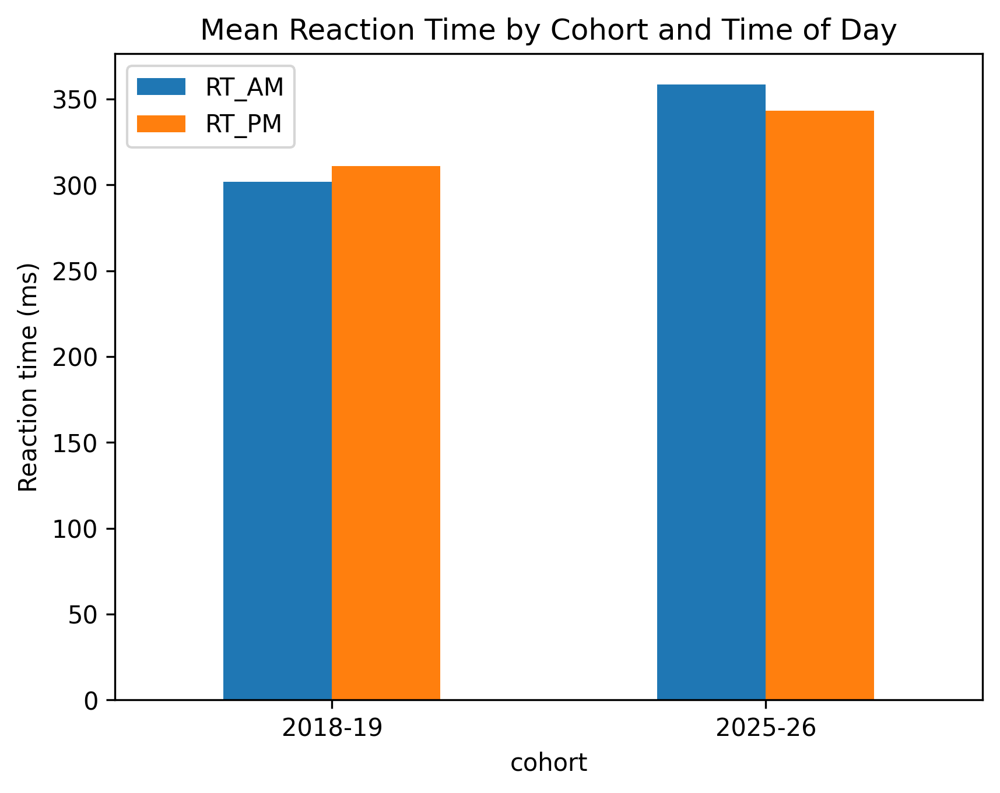
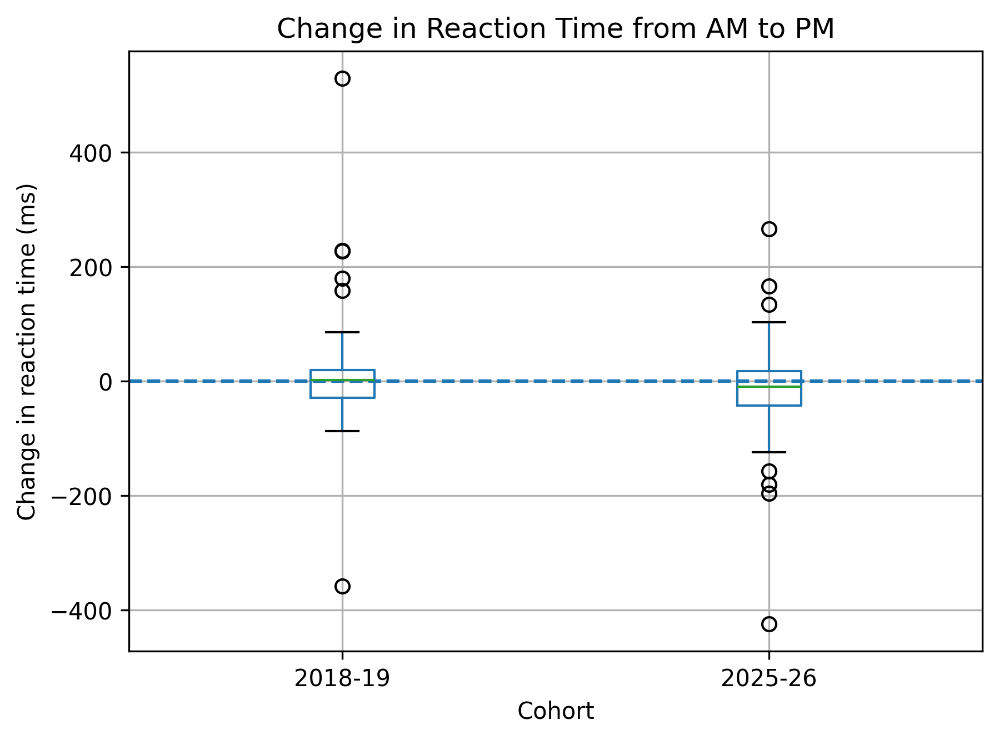
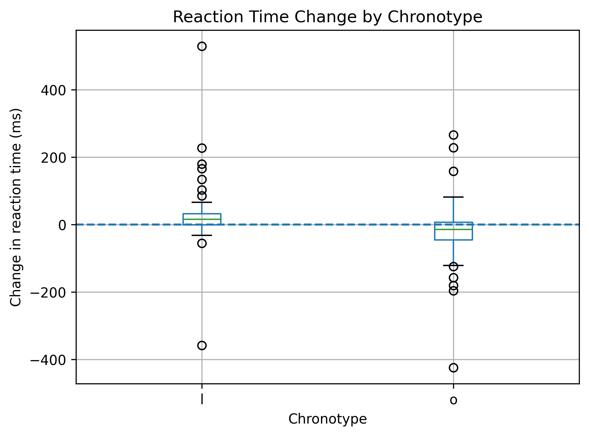

# Neuroscience Reaction Time Analysis

## Overview

This project analyses reaction time data from two cohorts of first-year Neuroscience students, collected in 2018–19 and 2025–26 using the same experimental procedure.

The analysis investigates whether changes in reaction time from morning to afternoon are associated with cohort, chronotype, caffeine consumption, and gaming.

## Research Questions

- Does reaction time change between the morning and afternoon?
- Does RT change differ between the two cohorts?
- Is RT change associated with chronotype?
- Is RT change associated with caffeine consumption?
- Is RT change associated with gaming?

## Methods

The analysis was conducted in Python using:

- Pandas for data handling
- NumPy for numerical computation
- Matplotlib for data visualisation
- SciPy for statistical testing

An independent-samples t-test was used to compare RT change between groups.

Potential outliers were identified using the IQR method, followed by sensitivity analyses to assess their influence on the results.

## Key Findings

- No statistically significant difference in RT change was observed between the two cohorts.
- A statistically significant difference was observed between the two chronotype groups.
- No statistically significant difference was observed between caffeine and decaf groups.
- No statistically significant difference was observed between gaming and non-gaming groups.
- The chronotype finding remained statistically significant after excluding potential outliers.

## Visualisations

### Mean Reaction Time by Cohort and Time of Day

### Change in Reaction Time by Cohort

### Reaction Time Change by Chronotype

## Limitations

This analysis is based on observational data, so the findings indicate associations rather than causal relationships.

The subgroup sizes were unequal, particularly for chronotype. Potential outliers were not assumed to be errors; instead, sensitivity analyses were used to assess whether they substantially affected the results.

## Project Structure

- `analysis.ipynb` - Python analysis and statistical testing
- `reaction-time-data.csv` - reaction time dataset
- `cohort_reaction_time.png` - reaction time visualisation
- `cohort_rt_change.png` - RT change by cohort
- `chronotype_rt_change.png` - RT change by chronotype
